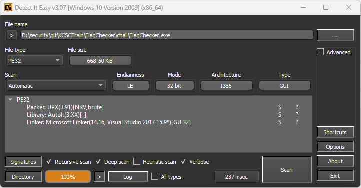
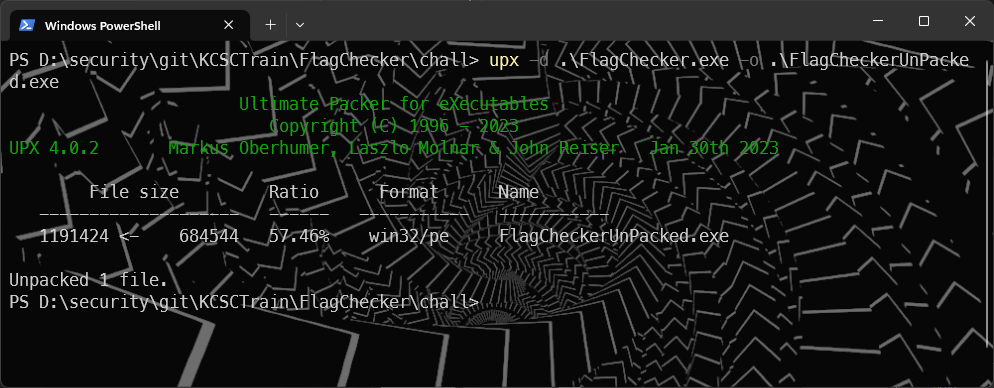
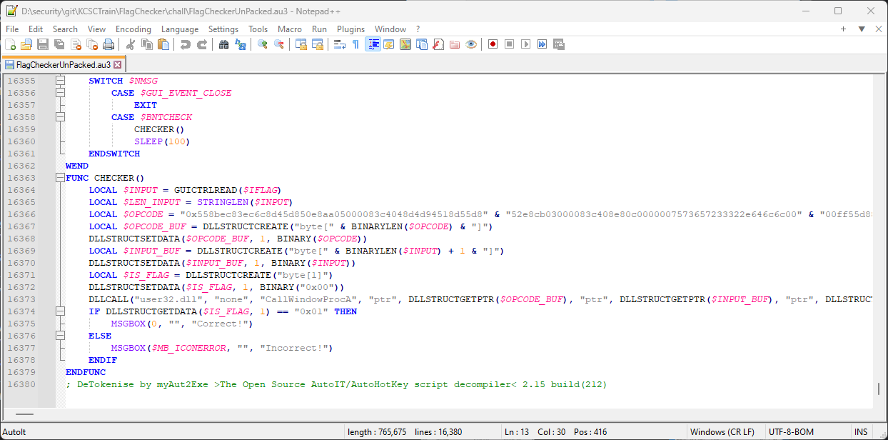
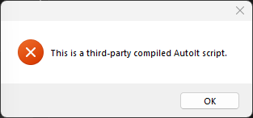
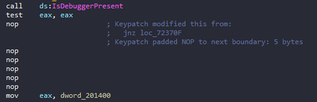
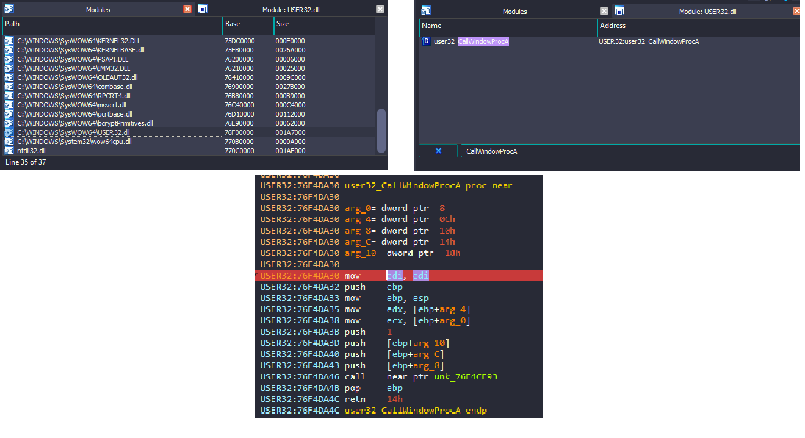
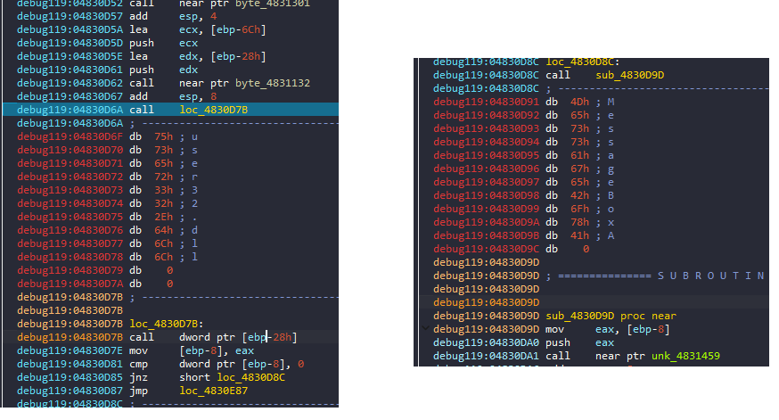

# FlagChecker

## Overview



* File PE32
* Pack bằng UPX 3.91
* Compile bằng AutoIT

## Unpack

Đầu tiên mình unpack bằng [UPX 4.0.2](https://github.com/upx/upx/releases/tag/v4.0.2) 



## AutToExe

Tiếp theo dùng myAutToExe trong [retoolkit](https://github.com/mentebinaria/retoolkit) thì được 1 file `FlagCheckerUnPacked.au3` mở file lên thì thấy hàm `CHECKER()`:



Ta thấy hàm này sẽ check `input` của chúng ta, bằng cách gọi hàm [DLLCALL](https://www.autoitscript.com/autoit3/docs/functions/DllCall.htm) trong AutoIT, hàm này gọi `CallWindowProcA`, với tham số là đoạn `opcode` ở trên và `input` ta nhập vào.

### CallWindowProcA

`CallWindowProcA` là một hàm trong Win32 API được sử dụng để gọi một hàm(procedure) để xử lý sự kiện của một cửa sổ trước đó.

## Reverse

Như vậy có thể đoạn Opcode kia có thể là hàm check `input`. Bây giờ chúng ta cần tìm đoạn Opcode kia trong chương trình và xem nó làm gì. Đầu tiên load chương trình vào IDA và run thử: 



Chương trình ấn `OK` và xem thì ta thấy trong hàm `sub_xx445D` có đoạn check nếu chương trình đang được debug thì hiện ra `MessageBox` trên. Như vậy ta chỉ cần patch dòng jump sau khi `call IsDebuggerPresent` thành nop là chương trình sẽ chạy bình thường:



Chúng ta đặt tạm Breakpoint ở hàm vừa check debug và chạy lại chương trình. Từ code AutoIt ta thấy hàm `CallWindowProcA` trong `user32.dll`. Như vậy chúng ta tìm thư viện `user32.dll` rồi tìm hàm `CallWindowProcA` trong cửa sổ `Modules` sau đó đặt breakpoint vào đó:



`F9` chạy tiếp chương trình, nhập flag, ta sẽ break tại hàm `CallWindowProcA`, trace qua từng dòng thì biết được `ebp+arg_0` là đoạn Opcode chúng ta cần tìm và `ebp+arg_4` là input. Chúng ta vào `ebp+arg_0` ấn `D` để lấy địa chỉ của Opcode,vào địa chỉ đó sử dụng chức năng `Make Code` để xem nó làm gì:



Sau đó ta sẽ gặp những đoạn code như này. Ở đây tác giả sử dụng cơ chế của `Calling Convention` là khi gọi hàm thì sẽ đẩy `return address` lên stack, `return address` là địa chỉ ngay sau dòng lệnh gọi hàm để làm địa chỉ trả về sau khi thực hiện xong hàm đó. Nhưng ở đây tác giả đã call 1 hàm để đẩy dữ liệu lên stack và tiếp tục call 1 hàm ngay sau đoạn dữ liệu để lấy luôn đoạn dữ liệu đó làm tham số luôn. 

Tiếp tục trace từng dòng cho đến hết đoạn so sánh thì mình viết lại được hàm đó bằng `C`, loại bỏ đi những chỗ không cần thiết thì hàm sẽ trông như này:

```c
#include <stdio.h>
#include <windows.h>
#include <wincrypt.h>
int CHECKER(char *RR){
HCRYPTPROV hProv;
if(!CryptAcquireContext(&hProv,NULL,NULL,PROV_RSA_FULL,0)){ 
    printf("CryptAcquireContext failed: %d\n", GetLastError());
    return 1;
} 
HCRYPTHASH hHash ;
if(!CryptCreateHash(hProv,CALG_SHA,0,0,&hHash)){ 
    printf("CryptCreateHash failed: %d \n", GetLastError());
}
DWORD len = strlen(RR);
if (!CryptHashData(hHash, RR, len, 0)) {
        printf("Error %d during CryptHashData!\n", GetLastError());
        CryptDestroyHash(hHash);
        CryptReleaseContext(hProv, 0);
        return 1;
    }
HCRYPTKEY  phKey;
if( !CryptDeriveKey(hProv,CALG_RC4, hHash,0, &phKey ))
 {
        CryptReleaseContext(hProv, 0);
        CryptDestroyHash(hHash);
        return 1;
  }
CryptDestroyHash(hHash);
if (!CryptEncrypt(phKey, 0, TRUE, 0, 0, &len, 0x400)) {
        return 1;
    }
char flag[100]={0};
char cipher[]={0xF8, 0x50, 0xCC, 0xEF, 0xE6, 0x3C, 0x35, 0x96, 0x1D, 0x61, 
  0xAE, 0xC0, 0xC5, 0x31, 0xCE, 0xB0, 0xE7, 0x1D, 0xED, 0xBC, 
	0x5D, 0x81, 0x69, 0x8A, 0x35, 0x74, 0x57, 0xB6};
scanf("%s",flag);
len = strlen(flag);
LPVOID memalloc = VirtualAlloc(0,len+1,0x1000,4); //MEM_COMMIT
memset(memalloc,0,len);
memcpy(memalloc,flag,28);
if (!CryptEncrypt(phKey,0,1,0,flag,&len,len)) {
        return 1;
    }
if(len != 28){
    printf("Wrong!");
    return 1;
}

if(memcmp(flag,cipher,28)){
    printf("Wrong!");
    return 1;
}

printf("Correct!");

CryptReleaseContext(hProv, 0);
  return 0;
}
int main(){
		char key[]="https://www.youtube.com/watch?v=dQw4w9WgXcQ";
  CHECKER(key);
}
```
Hàm này sẽ sử dụng thư viện Crypt32.dll để mã hóa flag với thuật toán RC4, key là link [này](https://www.youtube.com/watch?v=dQw4w9WgXcQ) được hash SHA. Rồi sau đó so sánh với byte đã cho để check flag . Do đó ta chỉ cần thay hàm `CryptEncrypt()` bằng hàm `CryptDecrypt()` để ra flag. 

## script

```c 
#include <stdio.h>
#include <windows.h>
#include <wincrypt.h>
int Init(char *RR){
    
HCRYPTPROV hProv;

if(!CryptAcquireContext(&hProv,NULL,NULL,PROV_RSA_FULL,0)){ //https://learn.microsoft.com/en-us/windows/win32/seccrypto/cryptographic-provider-types
    printf("CryptAcquireContext failed: %d\n", GetLastError());
    return 1;
} 
HCRYPTHASH hHash ;
if(!CryptCreateHash(hProv,CALG_SHA,0,0,&hHash)){ //https://learn.microsoft.com/en-us/windows/win32/seccrypto/alg-id
    printf("CryptCreateHash failed: %d \n", GetLastError());
}
DWORD len = strlen(RR);
if (!CryptHashData(hHash, RR, len, 0)) {
        printf("Error %d during CryptHashData!\n", GetLastError());
        CryptDestroyHash(hHash);
        CryptReleaseContext(hProv, 0);
        return 1;
    }
HCRYPTKEY  phKey;
if( !CryptDeriveKey(hProv,CALG_RC4, hHash,0, &phKey ))
 {
        CryptReleaseContext(hProv, 0);
        CryptDestroyHash(hHash);
        return 1;
  }

CryptDestroyHash(hHash);
if (!CryptEncrypt(phKey, 0, TRUE, 0, 0, &len, 0x400)) {
        return 1;
    }
LPVOID memalloc = VirtualAlloc(0,len+1,0x1000,4); //MEM_COMMIT

memset(memalloc,0,len);

char flag[]={  0xF8, 0x50, 0xCC, 0xEF, 0xE6, 0x3C, 0x35, 0x96, 0x1D, 0x61, 
  0xAE, 0xC0, 0xC5, 0x31, 0xCE, 0xB0, 0xE7, 0x1D, 0xED, 0xBC, 
	0x5D, 0x81, 0x69, 0x8A, 0x35, 0x74, 0x57, 0xB6};
len = strlen(flag);
CryptDecrypt(phKey,0,1,0,flag,&len);
 for(int i =0 ;i<len;i++){
  printf("%c",flag[i]);
 }

CryptReleaseContext(hProv, 0);

  return 0;
}
int main(){
	char key[]="https://www.youtube.com/watch?v=dQw4w9WgXcQ";
  Init(key);
}
```

## flag
```
KCSC{rC4_8uT_1T_L00k2_W31Rd}
```
