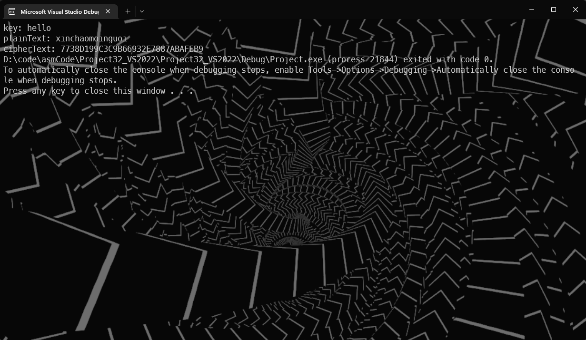

Chall: Code thuật toán mã hóa RC4
Điều kiện: Assembly 32 bit, window hoặc linux
Yêu cầu: - Chạy được
         -  input nhập vào là chữ hoặc số hoặc mật khẩu muốn encrypt
         -  Kết quả in ra theo dạng hex.
