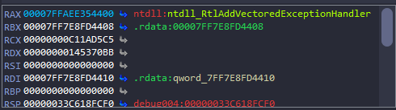

# VEH

## CFF Explorer


Chương trình được viết theo kiểu PE64

## Reverse


Cho vào ida chạy thử thì chương trình gặp lỗi chia không tại địa chỉ `00007FF6F566258C`, chắc sẽ có hàm xử lý exception:


Chúng ta thấy có 3 hàm trong đoạn này, qua debug thì mình biết được hàm `sub_7FF6F56611F0`  dùng để load thư viện cần thiết bằng `LoadLibrary`, đặc biệt có thư viện `crypt32.dll` chắc dùng để mã hóa flag:


 Hàm `sub_7FF6F5661000` sẽ nhận vào 2 tham số `0C11AD5C5h` và `145370BBh` là giá trị hash của WinApi, chúng ta có thể tra mã hash này là hàm gì ở [đây](https://github.com/tildedennis/malware/blob/master/neutrino_bot_5.1/api_hashes), hàm này sẽ resolve WinApi từ PEB cho chúng ta: 


Debug qua thì resolve ra hàm `RtlAddVectoredExceptionHandler`:



Hàm `RtlAddVectoredExceptionHandler` nếu chương trình xảy ra ngoại lệ chương trình sẽ nhảy đến hàm xử lý ngoại lệ, ở đây sẽ nhảy đến hàm `sub_7FF7E8FD11A0`:


Ta có thể thấy hàm so sánh lỗi tại địa chỉ của `ecx` với giá trị `0xC0000094` - đây là code lỗi [chia không](https://learn.microsoft.com/vi-vn/previous-versions/troubleshoot/visualstudio/silverlight/application-exception-0xc0000094-vmware), sau khi đọc hàm [AddVectoredExceptionHandler](https://learn.microsoft.com/en-us/windows/win32/api/errhandlingapi/nf-errhandlingapi-addvectoredexceptionhandler), thì biết được `ecx` ở đây chính là [EXCEPTION_POINTERS](https://learn.microsoft.com/en-us/windows/win32/api/winnt/ns-winnt-exception_pointers), và sẽ lấy giá trị `ExceptionCode` trong phần đầu tiên của phần [EXCEPTION_RECORD](https://learn.microsoft.com/en-us/windows/win32/api/winnt/ns-winnt-exception_record) để so sánh với `0xC0000094`. Sau đó `EXCEPTION_POINTERS` được cộng thêm 8 để lấy địa chỉ của [CONTEXT struc](https://learn.microsoft.com/en-us/windows/win32/api/winnt/ns-winnt-context), phần này sẽ lưu giá trị những thanh ghi ngay tại thời điểm gặp exception, và sau khi hàm xử lý ngoại lệ thực hiện xong sẽ trả lại giá trị cho thanh ghi, vì vậy giá trị `(a1 + 8) + 120i64)` là thanh ghi `rax`, `+184` là `r8`, `+192` là `r9` và `+248` là `rip` trong [CONTEXT struc](https://learn.microsoft.com/en-us/windows/win32/api/winnt/ns-winnt-context), chỗ này ta có thể `Y` khai báo lại kiểu dữ liệu của `a1` thành `EXCEPTION_POINTERS` để ida tự xác định cho chúng ta:


Như vậy khi gặp lỗi, chương trình sẽ resolve api vào `rax` và tính từ câu lệnh ta gặp lỗi `rip` sẽ cộng thêm 4. Bởi vì hàm xử lý ngoại lệ này có check `ExceptionCode` nên để bypass ta chỉ cần [patch](https://github.com/keystone-engine/keypatch) bỏ phần so sánh đi:


Vậy cứ khi gặp `div rax`(dòng sẽ xảy ra lỗi chia 0) thì ta sẽ sửa `rip` nhảy vào hàm này là xong, hoặc ta có thể dùng script python sử dụng Appcall để gọi hàm `sub_7FF6F5661000` để resolve api vào `rax` và cộng `rip` lên 4.Script:
```python
set_reg_value(Appcall.sub_7FF79E141000(get_reg_value("r8"),get_reg_value("r9")).value,"rax")
set_reg_value(get_reg_value("rip") + 4,"rip" )
```


Ta thấy `rip` đã tăng thêm 4 và đã resovle được api vào `rax`. Chúng ta tiếp tục `F8` và gặp `call main` thì `F7` sẽ vào được hàm `main`, rồi dùng `C` để `MakeCode` thì ta thấy hàm `main` cũng rất nhiều dòng cố tình tạo ra lỗi để nhảy vào hàm xử lý ngoại lệ :


Vậy tương tự như trên mỗi khi chương trình chạy đến dòng `div rax` thì ra chạy script xem nó resolve ra hàm gì, và nhảy `rip` lên 4 để chương trình chạy đúng flow. Sau khi trace từng dòng 1 thì mình đã viết được hàm tương tự hàm `main` với C:
```c
#include <stdio.h>
#include <windows.h>
#include <wincrypt.h>

int Init(char *RR){
    
HCRYPTPROV hProv;

if(!CryptAcquireContext(&hProv,NULL,NULL,PROV_RSA_AES,0)){
    printf("CryptAcquireContext failed: %d\n", GetLastError());
    return 1;
} 
HCRYPTHASH hHash ;
if(!CryptCreateHash(hProv,CALG_SHA_256,0,0,&hHash)){
    printf("CryptCreateHash failed: %d \n", GetLastError());
}
DWORD len = strlen(RR);

if (!CryptHashData(hHash, RR, len, 0)) {
        printf("Error %d during CryptHashData!\n", GetLastError());
        CryptDestroyHash(hHash);
        CryptReleaseContext(hProv, 0);
        return 1;
    }

  if (!CryptGetHashParam(hHash, HP_HASHVAL, RR, &len, 0)) {
        printf("Error %d during CryptGetHashParam!\n", GetLastError());
        CryptDestroyHash(hHash);
        CryptReleaseContext(hProv, 0);
        return 1;
    }
CryptDestroyHash(hHash);
CryptReleaseContext(hProv, 0);

  return 0;
}

int EncFlag(char *flag){
    char hash[] = "https://www.youtube.com/watch?v=dQw4w9WgXcQ";
    Init(hash);
DWORD dwDataLen = strlen(flag);
  for(int i= 0; i<strlen(hash);i++){
    hash[i] = hash[i] & 0xff;
  }
  BYTE hihi [] = "aMicrosoft Enhanced RSA and AES Cryptographic Provider";
    HCRYPTPROV hProv;
HCRYPTKEY hKey;
if(!CryptAcquireContext(&hProv,NULL,NULL,PROV_RSA_AES,0)){
    printf("CryptAcquireContext failed: %d\n", GetLastError());
    return 1;
} 
memset(hihi+11,0,32);
char dump[]= {0x08, 0x02, 0x00, 0x00, 0x10, 0x66, 0x00, 0x00, 0x20, 0x00, 
  0x00, 0x00};
memcpy(hihi,dump,12);
memcpy(hihi+12,hash,0x20);
DWORD dwKeyLen = 44;
if (!CryptImportKey(hProv, hihi, dwKeyLen, 0, 0, &hKey)) {
        printf("Error %d during CryptImportKey!\n", GetLastError());
        CryptReleaseContext(hProv, 0);
        return 1;
    }
DWORD dwMode = 1;//CRYPT_MODE_CBC
if (!CryptSetKeyParam(hKey, 4, (BYTE*)&dwMode, 0)) { //4= KP_MODE
    printf("Error %d during CryptSetKeyParam1!\n", GetLastError());
    CryptDestroyKey(hKey);
    CryptReleaseContext(hProv, 0);
    return 1;
}
BYTE pbIV[16] = {0x01, 0x02, 0x03, 0x04, 0x05, 0x06, 0x07, 0x08, 0x09, 0x0a, 0x0b, 0x0c, 0x0d, 0x0e, 0x0f,0x10};

if (!CryptSetKeyParam(hKey, 1, pbIV, 0)) { //1=KP_IV
    printf("Error %d during CryptSetKeyParam2!\n", GetLastError());
    CryptDestroyKey(hKey);
    CryptReleaseContext(hProv, 0);
    return 1;
}
if (!CryptEncrypt(hKey, 0, TRUE, 0, flag, &dwDataLen, 0x400)) {
        printf("Error %d during CryptEncrypt!\n", GetLastError());
        return 1;
    }
CryptDestroyKey(hKey);
CryptReleaseContext(hProv, 0);

return 0 ;

}

int main()
{
    BYTE flag[256];
    memset(flag, 0, 256*sizeof(char));
    printf("Enter Flag:");
    scanf("%s",&flag);
    BYTE cipher[] = {0xE5, 0x60, 0x44, 0x09, 0x42, 0xC4, 0xBB, 0xDE, 0xF6, 0xA1, 
  0x2D, 0x93, 0xD9, 0x1D, 0x13, 0x72, 0xAF, 0x8D, 0x4C, 0xF7, 
  0xA7, 0x9F, 0x1F, 0xB9, 0x99, 0x68, 0x9C, 0xB8, 0xC2, 0x4C, 
  0x4F, 0x85};
    EncFlag(flag);

    for(int i =0;i<32;i++){
        printf("%x ",flag[i]&0xff);
        if((flag[i]&0xff)!=cipher[i]){
            printf("[+] Wrong!");
            return 1;
        }
    }
    printf("[+] Correct!");


    return 0;
}
```
Tóm tắt lại là hàm sẽ dùng thuật toán mã hóa `AES` với key 32 Byte được tạo bằng cách hash `SHA_256` link [này](https://www.youtube.com/watch?v=dQw4w9WgXcQ), CBC mode và với Vectơ khởi tạo(IV) từ 1 đến 16, sau đó so sánh với `cipher[]`. Như vậy muốn decypt tìm flag ta chỉ cần thay hàm `CryptEncrypt` bằng hàm `CryptDecrypt`
## script
```c
#include <stdio.h>
#include <windows.h>
#include <wincrypt.h>

int Init(char *RR){
    
HCRYPTPROV hProv;

if(!CryptAcquireContext(&hProv,NULL,NULL,PROV_RSA_AES,0)){
    printf("CryptAcquireContext failed: %d\n", GetLastError());
    return 1;
} 
HCRYPTHASH hHash ;
if(!CryptCreateHash(hProv,CALG_SHA_256,0,0,&hHash)){
    printf("CryptCreateHash failed: %d \n", GetLastError());
}
DWORD len = strlen(RR);

if (!CryptHashData(hHash, RR, len, 0)) {
        printf("Error %d during CryptHashData!\n", GetLastError());
        CryptDestroyHash(hHash);
        CryptReleaseContext(hProv, 0);
        return 1;
    }

  if (!CryptGetHashParam(hHash, HP_HASHVAL, RR, &len, 0)) {
        printf("Error %d during CryptGetHashParam!\n", GetLastError());
        CryptDestroyHash(hHash);
        CryptReleaseContext(hProv, 0);
        return 1;
    }
CryptDestroyHash(hHash);
CryptReleaseContext(hProv, 0);

  return 0;
}

int EncFlag(char *flag){
    char hash[] = "https://www.youtube.com/watch?v=dQw4w9WgXcQ";
    Init(hash);

  for(int i= 0; i<strlen(hash);i++){
    hash[i] = hash[i] & 0xff;
  }
  BYTE hihi [] = "aMicrosoft Enhanced RSA and AES Cryptographic Provider";
    HCRYPTPROV hProv;
HCRYPTKEY hKey;
if(!CryptAcquireContext(&hProv,NULL,NULL,PROV_RSA_AES,0)){
    printf("CryptAcquireContext failed: %d\n", GetLastError());
    return 1;
} 

memset(hihi+11,0,32);
char dump[]= {0x08, 0x02, 0x00, 0x00, 0x10, 0x66, 0x00, 0x00, 0x20, 0x00, 
  0x00, 0x00};
memcpy(hihi,dump,12);
memcpy(hihi+12,hash,0x20);
char realkey[32]={0};
int j =0;

DWORD dwKeyLen = 44;
if (!CryptImportKey(hProv, hihi, dwKeyLen, 0, 0, &hKey)) {
        printf("Error %d during CryptImportKey!\n", GetLastError());
        CryptReleaseContext(hProv, 0);
        return 1;
    }

DWORD dwMode = 1;//CRYPT_MODE_CBC
if (!CryptSetKeyParam(hKey, 4, (BYTE*)&dwMode, 0)) { //4= KP_MODE
    printf("Error %d during CryptSetKeyParam1!\n", GetLastError());
    CryptDestroyKey(hKey);
    CryptReleaseContext(hProv, 0);
    return 1;
}
BYTE pbIV[16] = {0x01, 0x02, 0x03, 0x04, 0x05, 0x06, 0x07, 0x08, 0x09, 0x0a, 0x0b, 0x0c, 0x0d, 0x0e, 0x0f,0x10};

if (!CryptSetKeyParam(hKey, 1, pbIV, 0)) { //1=KP_IV
    printf("Error %d during CryptSetKeyParam2!\n", GetLastError());
    CryptDestroyKey(hKey);
    CryptReleaseContext(hProv, 0);
    return 1;
}
DWORD lenFlag = 0x20;
 if (!CryptDecrypt(hKey, 0, TRUE, 0, flag, &lenFlag)) {
        printf("Error %d during CryptDecrypt!\n", GetLastError());
        return 0;
    }

CryptDestroyKey(hKey);
CryptReleaseContext(hProv, 0);

return 0 ;

}

int main()
{

    BYTE flag[] = {0xE5, 0x60, 0x44, 0x09, 0x42, 0xC4, 0xBB, 0xDE, 0xF6, 0xA1, 
  0x2D, 0x93, 0xD9, 0x1D, 0x13, 0x72, 0xAF, 0x8D, 0x4C, 0xF7, 
  0xA7, 0x9F, 0x1F, 0xB9, 0x99, 0x68, 0x9C, 0xB8, 0xC2, 0x4C, 
  0x4F, 0x85};
  
     EncFlag(flag);

    for(int i =0;i<0x1F;i++){
        printf("%c",flag[i]&0xff);
    }


    return 0;
}
```
## flag
`KMACTF{3Xc3pTI0n_3v3rYwh3R3@_@}`

 


