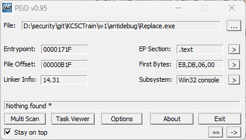
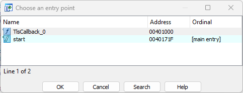
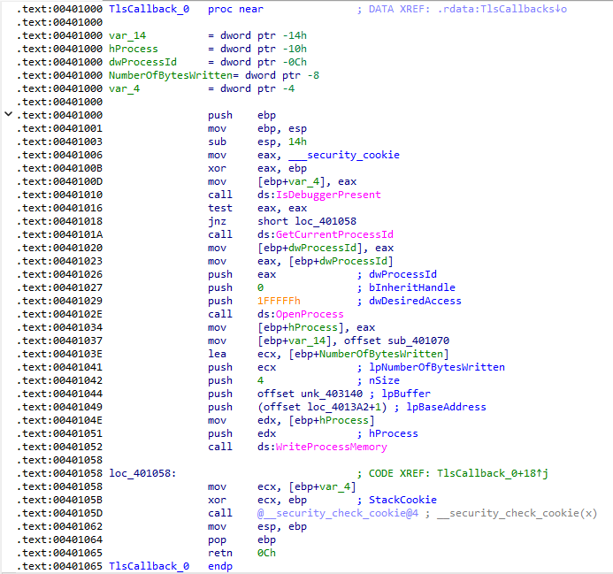
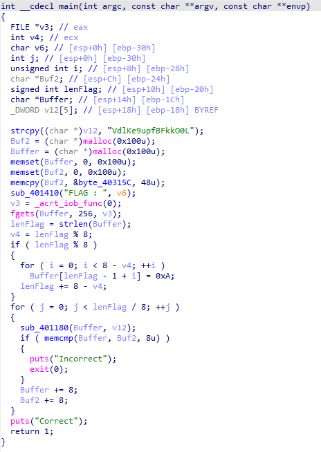
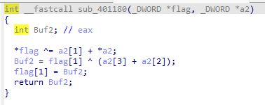
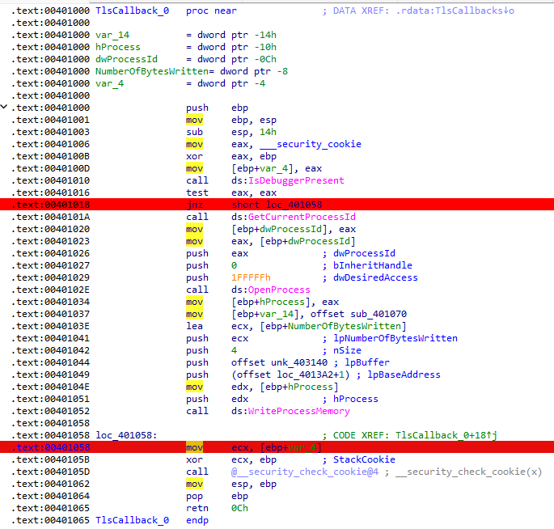
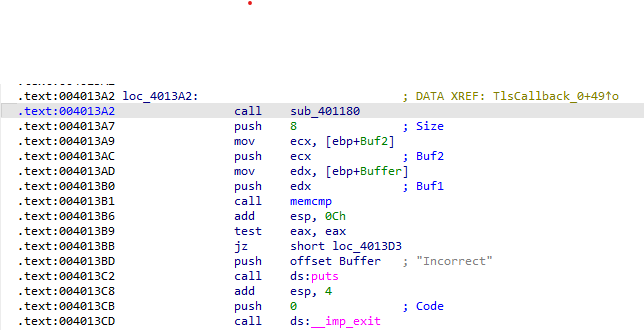
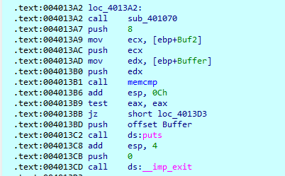
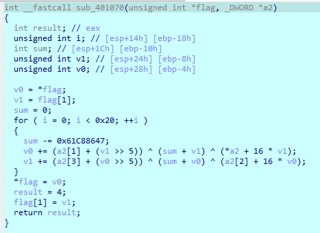

# Replace.exe

## Overview
Bài này được viết theo kiểu PE32



Load vào ida thấy có Hàm `TlsCallback_0` 
### TLSCallback
TLS(Thread Local Storage) là một cơ chế được cung cấp bởi các hệ điều hành để cho phép các luồng riêng lẻ trong 1 chương trình đa luồng có không gian lưu trữ dữ liệu riêng của chúng. Mỗi luồng có thể sử dụng khu vực TLS riêng cho luồng, như các tùy chọn cấu hình dành riêng cho luồng, handle, hoặc những cấu trúc dữ liệu của luồng.Hàm `TLSCallback` được gọi bởi kernel Windows khi TLS index của thread được sử dụng lần đầu tiên để truy cập bộ nhớ cục bộ của luồng. Hàm này thường được dùng để khởi tạo dữ liệu TLS cho luồng, thường liên quan đến việc cấp phát bộ nhớ và khởi tạo cấu trúc dữ liệu. Do đó nó sẽ luôn chạy trước hàm main của chúng ta. 
Chúng ta cũng có thể xem entry point trong IDA ta ấn `Ctrl+E`:

 

Ta cũng thấy được rằng địa chỉ của `TlsCallback_0` nằm trước hàm main do đó ta sẽ xem hàm đó trước:



Đây là flow của hàm `TlsCallback_0`. Ta có thể thấy đầu tiên hàm sẽ gọi Hàm [`IsDebuggerPresent`](https://anti-debug.checkpoint.com/techniques/debug-flags.html#using-win32-api-isdebuggerpresent), cái tên của hàm cũng đã nói lên nhiệm vụ của nó rồi. Hàm này đơn giản là chỉ check cở BeingDebugged ở trong [PEB](https://www.nirsoft.net/kernel_struct/vista/PEB.html) xem chương trình có đang bị debug hay không, nếu không thì nó sẽ lấy `ProcessId` của chương trình đang chạy và sẽ dùng hàm `WriteProcessMemory` để  sửa 4 btye code tại `offset loc_4013A2+1`. Còn nếu thấy debug thì chương trình sẽ nhảy thẳng tới hàm main. Vì thế tí nữa chúng ta sẽ xem chương trình sửa code như nào.
### Main
Tạm thời bỏ qua, ta sẽ xem hàm main:



Hàm main khởi tạo giá trị `v12`, yêu cầu chúng ta nhập flag, rồi khởi tạo 48 byte dữ liệu vào `Buf2`, sau đó mã hóa flag của chúng ta với `v12` với hàm `sub_401180`:



Sau đó kiểm tra với `Buf2`, nếu giống thì in ra `Correct` còn khác thì `Incorrect`.

## Reverse 
Chúng ta quay lại hàm `TlsCallBack`,vì hàm này sẽ chạy đầu tiên và nếu phát hiện debug thì sẽ bị sửa code, vì thế chúng ta sẽ set breakpoint ngay tại lệnh jump để tí debug chúng ta sửa cờ cho chương trình đi đúng theo ý chúng ta và một breakpoint ở sau lệnh gọi hàm `WriteProcessMemory` xem chương trình của chúng ta bị sửa như nào:



Chúng ta xem tại `offset loc_4013A2+1` ban đầu là gì:



Chính là gọi hàm mã hóa flag của chúng ta `sub_401180`. Bắt đầu debug, sau đó sửa cờ `ZF` để chương trình chạy vào bên trong và ấn `F9` cho chương trình dừng tại breakpoint số 2. Lúc này ta kiểm tra lại `offset loc_4013A2+1` thì đã bị đổi thành gọi hàm `sub_401170`:



Ấn vào hàm `sub_401170` rồi `F5` ta được:



Vậy thay vì được mã hóa bằng hàm `sub_401180`, flag sẽ được mã hóa bằng `sub_401170` và so sánh với `Buf2`. Lên mạng tìm ta thấy được hàm [decypt](https://github.com/p4-team/ctf/blob/master/2016-03-06-bkpctf/re_4_unholy/decrypt.cpp), sửa lại key, matrix, và biểu thức mã hóa ta ra được script.

## script
```c
#include <stdio.h>
// http://tpforums.org/forum/threads/2158-XTEA-Encryption-Decryption-Code/page4
void process_decrypt(unsigned  int *v, unsigned  int *k){
	unsigned  int v0 = v[0],	v1 = v[1], i, 
		delta = 0x61C88647,
		sum = 0xC6EF3720;
	for(i = 0; i < 32; i++){   
		v1 -= (k[3] + (v0 >> 5)) ^ (sum + v0) ^ (k[2] + 16 * v0);
		v0 -= (k[1] + (v1 >> 5)) ^ (sum + v1) ^ (*k + 16 * v1);
		sum += delta;
	}
	v[0] = v0;
	v[1] = v1;
}

void print(unsigned  int x){
	printf("%c%c%c%c", x&0xFF, (x&0xFF00)>>8,
			(x&0xFF0000)>>16, (x&0xFF000000)>>24);
}


int main(){
	unsigned  int key[]={0x4B6C6456,0x70753965 ,0x6B464266 ,0x4C304F6B};
	printf("\n");
	unsigned  int matrix[]={
		  0x2a302c19,0x254f979,0xd66ca9b3,0x4958091,0xa3e85929,0x86bd790f,0x6c1305af,0x2bdb75fe,0x5df0e0ae,0x89864b88,0x45ac6633,0xa6786c9a
	};
	for(int i=0;i<6;i++){
		process_decrypt(matrix+2*i, key);
	}
	for(int i=0;i<12;i++){
		print(matrix[i]);
	}
}

```
## flag 
`PTITCTF{bdc90e23aa0415e94d0ac46a938efcf3}`


