# Challenge:antidebug_3

## CFF

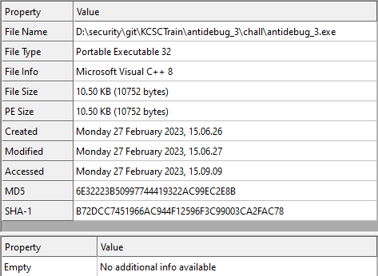

Bài được viết theo kiểu PE32

Load vào ida và bắt đầu từ hàm main:

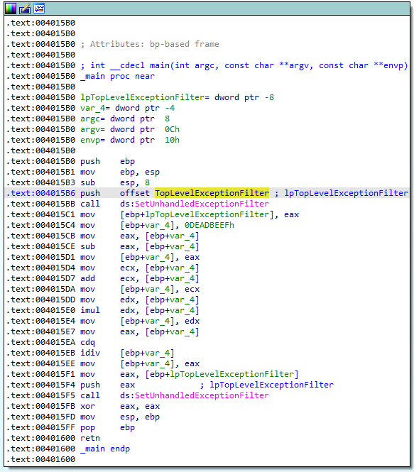

### [SetUnhanledExceptionFilter()](https://learn.microsoft.com/en-us/windows/win32/api/errhandlingapi/nf-errhandlingapi-setunhandledexceptionfilter)

Hàm này thường được dùng để xử lý ngoại lệ, nếu có lỗi nào thì chương trình sẽ gọi một trình gỡ lỗi để xử lý, nhưng nếu đang chạy trong debug, thì trình gỡ lỗi sẽ không được gọi mà chuyển thẳng đến debugger. Nhưng trong bài này, tác giả đang dùng hàm này và cố tình tạo ra lỗi để nhảy đến hàm [`TopLevelExceptionFilter`](https://anti-debug.checkpoint.com/techniques/exceptions.html#unhandledexceptionfilter). Vì lỗi sẽ bị chuyển đến debugger nên trước khi xảy ra lỗi ta sẽ sửa EIP để nhảy đến hàm `TopLevelExceptionFilter`. Đây là đoạn code sẽ tạo ra lỗi chia 0:

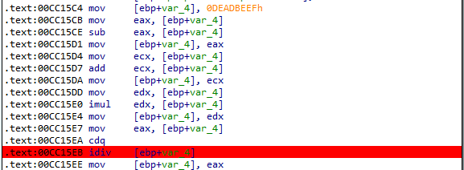

Ta vào thẳng hàm `TopLevelExceptionFilter` - `0x00CC14C0`, sau khi vào hàm ta thấy được một đoạn dữ liệu, ta có thể ấn `C` để `Make Code` thì ta được như này: 

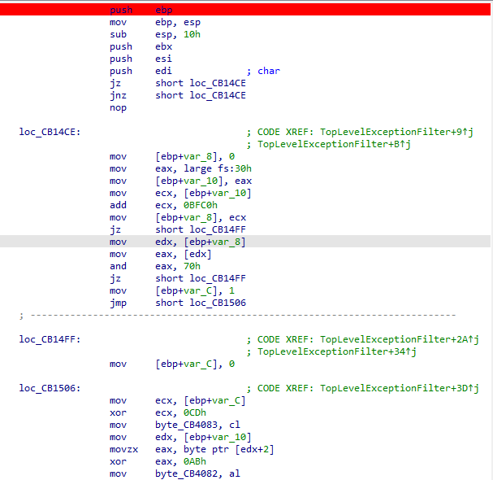

### PEBDebug

Lênh `mov eax, large fs:30h` sẽ lấy địa chỉ của PEB trong [TIB](https://en.wikipedia.org/wiki/Win32_Thread_Information_Block) (Thread Information Block ),  `fs:30h` là địa chỉ của PEB, ta thấy có 2 biến `byte_CB4082` và `byte_CB4083` sẽ được khởi tạo ở đầu chương trình, Biến `byte_CB4082` được tạo bằng cách check xem chương trình có debug hay không sử dụng `BeingDebugged` trong cấu trúc [PEB](https://processhacker.sourceforge.io/doc/ntpebteb_8h_source.html), như vậy nếu không debug sẽ trả về `0xAB`: 

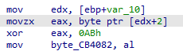

Còn biến `byte_CB4083` phụ thuộc vào `v4` check xem `v3` đã đúng địa chỉ của PEB chưa thôi, và Check [`NtGlobalFlag`](https://anti-debug.checkpoint.com/techniques/debug-flags.html#manual-checks-ntglobalflag), nếu không debug thì sẽ là `0xCD`.Mình sẽ rename tên biến `byte_CB4082` thành `isAB` và `byte_CB4083` thành `isCD` cho dễ nhớ và đây là mã giả của hàm: 

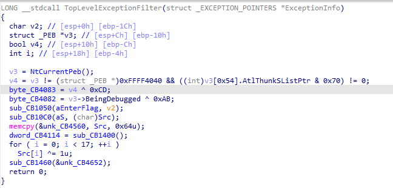

Còn đây là phần còn lại của hàm:

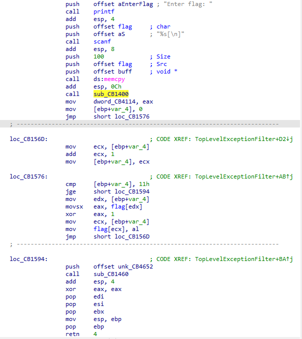

Tiếp theo hàm yêu cầu nhập `flag` và copy 100 kí tự sang một biến khác(có thể flag sẽ dài 100 kí tự). Rồi chương trình gọi hàm `sub_CB1400`:

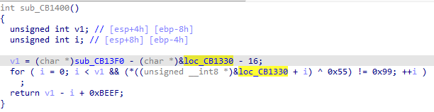

Hàm này đơn giản là check `0xCC(int 3)` - nghĩa là check xem ta có đặt breakpoint trong đoạn code hàm đang xét không, vì vậy nếu không debug hàm này sẽ trả về `0xBEEF` và mình là rename tên biến được lưu sau câu lệnh gọi hàm thành `isBEEF`. 

## Kí tự 0-16
Tiếp theo hàm `xor` 16 kí tự đầu cùa flag với 1

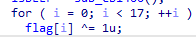

Sau đó gọi hàm `sub_CB1460` với tham số truyền vào là kí tự thứ 18 của flag (vì kí tự đầu tiên của flag được lưu tại `CB4640`), vậy kí tự 17 đâu ?  

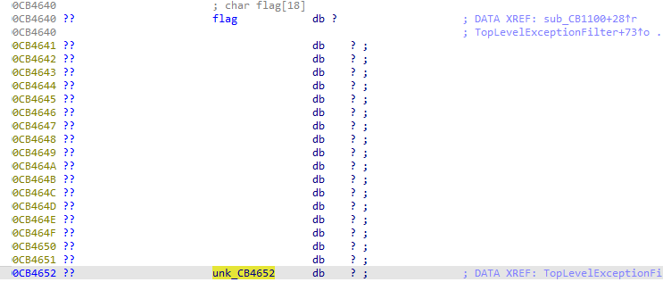

## Kí tự 18-25

Ấn vào hàm `sub_CB1460` rồi ấn vào `loc_CB1330` luôn ta sẽ thấy hàm này: 

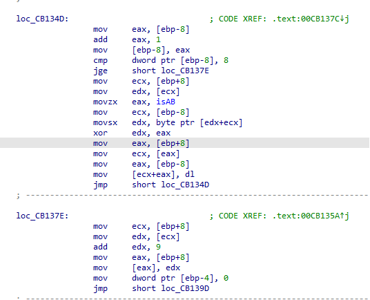

Hàm này lấy 8 kí tự tiếp theo của flag lần lượt `xor 0xAB`.Sau khi thực hiện xong sẽ nhảy tới `loc_CB137E` để cộng lên vị trí flag lên 9 kí tự là vị trí 27.Vậy kí tự 26 lại đâu? 

## Kí tự 27-38


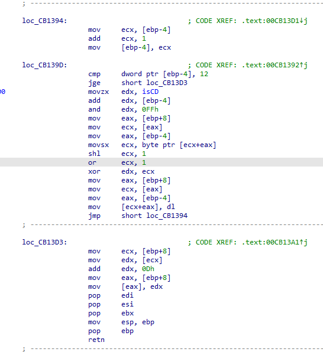

Mình sẽ viết lại hàm này với python
``` python
j=0
for i in range(27,39,1):
    a=(0xcd+j)&0xff
    flag[i]=flag[i]<<1
    flag[i]^=1
    flag[i]^=a  
    j+=1
```
Hàm tính toán 12 kí tự, sau đó lại cộng lên 13 kí tự và bỏ qua kí tự 39 rồi return về hàm `sub_CB1460`

## Kí tự 40-57

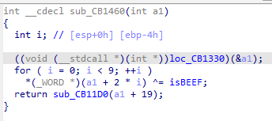

Hàm xor lần lượt từng 2 byte flag với 2 byte `0xBEEF` ta đã tính toán được lúc đầu.Tính toán 18 kí tự, rồi cộng lên 19 kí tự bỏ qua kí tự 58

## Kí tự 59-63 & 65-68

Sau đó nhảy đến hàm `sub_CB11D0`. Đây là flow của hàm: 

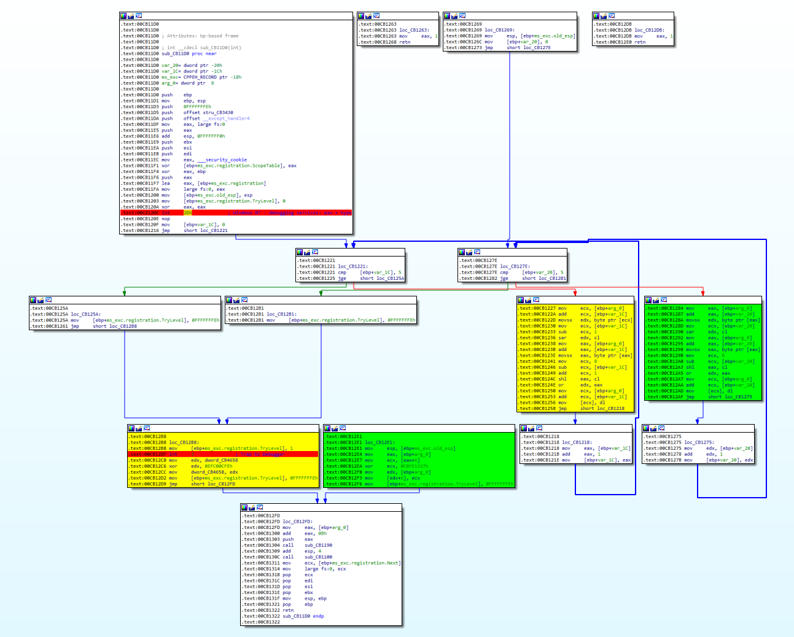

Hàm này có hai chỗ để check debug [`int 2dh`](https://anti-debug.checkpoint.com/techniques/assembly.html#int2d) và [`int 3`](https://anti-debug.checkpoint.com/techniques/assembly.html#int3) ( mình đã đặt breapoint màu đỏ), cơ chế hàm này cũng giống `SetUnhanledExceptionFilter()` ban đầu, nếu trong block `ms_exc.registration.TryLevel` có xảy ra ngoại lệ thì sẽ ngay lập tức nhảy đến hàm `ms_exc.old_esp`, còn nếu chúng ta debug thì ngoại lệ sẽ gửi thẳng đến debugger và không thể xử lý, nếu chúng ta cố chấp debug tiếp chúng ta sẽ đi vào `block` màu vàng, thì sẽ bị sai. 

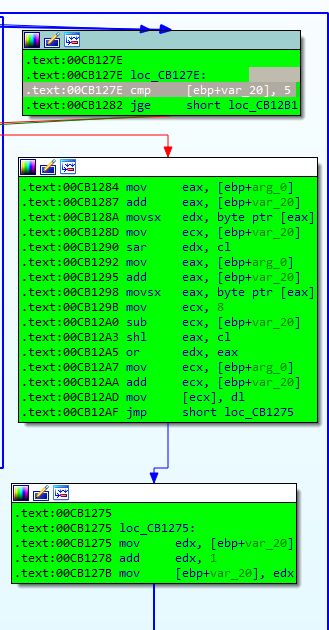

hàm này tính toán từ kí tự 59-63, mình sẽ viết lại hàm 
```python
j=0
for i in range(59,64,1):
    arr[i]=((arr[i]>>j) & 0xff) | ((arr[i]<<(8-j))& 0xff)
    j+=1
```
Bỏ qua kí tự 64, hàm này lấy 4 byte kí tự từ 65-68 xor với 4 byte `0x0xC0FE1337`

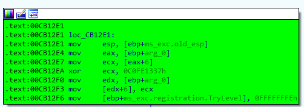


Đây là mã giả của hàm, nếu theo flow này chúng ta sẽ bị sai.

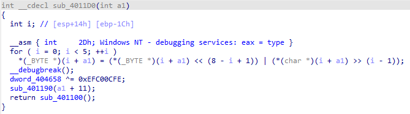

## Kí tự 70 đến 99

Sau đó sẽ nhảy vào hàm `sub_CB1190` và tính toán nốt 30 kí tự cuối

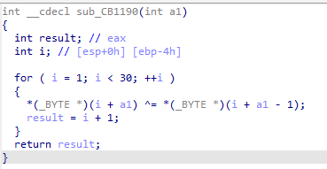

Hàm này xor kí tự hiện tại với kí tự đằng trước.

## Check

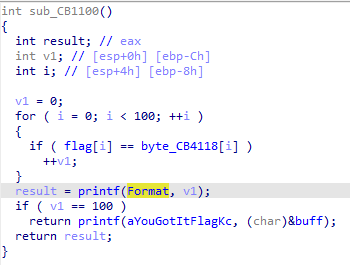

Hàm sẽ check flag của chúng ta với giá trị ở `byte_CB4118`:

`cipher=[0x74, 0x6F, 0x69, 0x35, 0x4F, 0x65, 0x6D, 0x32, 0x32, 0x79, 
0x42, 0x32, 0x71, 0x55, 0x68, 0x31, 0x6F, 0x5F, 0xDB, 0xCE, 
0xC9, 0xEF, 0xCE, 0xC9, 0xFE, 0x92, 0x5F, 0x10, 0x27, 0xBC, 
0x09, 0x0E, 0x17, 0xBA, 0x4D, 0x18, 0x0F, 0xBE, 0xAB, 0x5F, 
0x9C, 0x8E, 0xA9, 0x89, 0x98, 0x8A, 0x9D, 0x8D, 0xD7, 0xCC, 
0xDC, 0x8A, 0xA4, 0xCE, 0xDF, 0x8F, 0x81, 0x89, 0x5F, 0x69, 
0x37, 0x1D, 0x46, 0x46, 0x5F, 0x5E, 0x7D, 0x8A, 0xF3, 0x5F, 
0x59, 0x01, 0x57, 0x67, 0x06, 0x41, 0x78, 0x01, 0x65, 0x2D, 
0x7B, 0x0E, 0x57, 0x03, 0x68, 0x5D, 0x07, 0x69, 0x23, 0x55, 
0x37, 0x60, 0x14, 0x7E, 0x1D, 0x2F, 0x62, 0x5F, 0x62, 0x5F]`

Ta có thể đấy những kí tự mà ta bỏ qua là kí tự `0x5f` là dấu `_`. Vậy ta cần viết hàm reverse tất cả những phần ở trên với `cipher` này sẽ ra được `flag`

## script

```python
arr  = [0x74, 0x6F, 0x69, 0x35, 0x4F, 0x65, 0x6D, 0x32, 0x32, 0x79, 
0x42, 0x32, 0x71, 0x55, 0x68, 0x31, 0x6F, 0x5F, 0xDB, 0xCE, 
0xC9, 0xEF, 0xCE, 0xC9, 0xFE, 0x92, 0x5F, 0x10, 0x27, 0xBC, 
0x09, 0x0E, 0x17, 0xBA, 0x4D, 0x18, 0x0F, 0xBE, 0xAB, 0x5F, 
0x9C, 0x8E, 0xA9, 0x89, 0x98, 0x8A, 0x9D, 0x8D, 0xD7, 0xCC, 
0xDC, 0x8A, 0xA4, 0xCE, 0xDF, 0x8F, 0x81, 0x89, 0x5F, 0x69, 
0x37, 0x1D, 0x46, 0x46, 0x5F, 0x5E, 0x7D, 0x8A, 0xF3, 0x5F, 
0x59, 0x01, 0x57, 0x67, 0x06, 0x41, 0x78, 0x01, 0x65, 0x2D, 
0x7B, 0x0E, 0x57, 0x03, 0x68, 0x5D, 0x07, 0x69, 0x23, 0x55, 
0x37, 0x60, 0x14, 0x7E, 0x1D, 0x2F, 0x62, 0x5F, 0x62, 0x5F]

for i in range(0,17,1):
    arr[i] ^=1
for i in range(18,26,1):
    arr[i] ^= 0xAB
j=0
for i in range(27,39,1):
    a=(0xcd+j)&0xff
    arr[i]^=a
    arr[i]^=1
    arr[i]=arr[i]>>1
    j+=1
for i in range(40,58,2):
    arr[i]^=0xEF
    arr[i+1]^=0xBE

j=0
for i in range(59,64,1):
    arr[i]=((arr[i]<<j) & 0xff) | ((arr[i]>>(8-j))& 0xff)
    j+=1
i=65
arr[i]=arr[i]^0x37
i+=1
arr[i]=arr[i]^0x13
i+=1
arr[i]=arr[i]^0xfe
i+=1
arr[i]=arr[i]^0xc0
for i in range(99,70,-1):
    arr[i]=arr[i-1]^arr[i]
for i in range(len(arr)):
    print(chr(arr[i]),end="")

```
## flag
`unh4Ndl33xC3pTi0n_pebDebU9_nt9lob4Lfl49_s0F7w4r38r34Kp01n7_int2d_int3_YXV0aG9ydHVuYTk5ZnJvbWtjc2M===`


