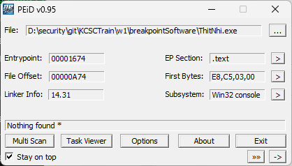

# ThitNhi

## Overview
Bài được viết theo kiểu PE32



## Reverse
Load file vào IDA và F5 để xem code và rename hàm và biến cho dễ nhìn


Đầu tiên chương trình yêu cầu ta nhập flag bao gồm 13 kí tự `fgets(flag, 14, v3)`, sau đó sẽ khởi tạo một mảng dữ liệu `v11` để tí nữa check `flag` của chúng ta.Tiếp theo hàm sẽ tính kích thước của hàm `main()` bằng hàm SizeOfFunction:


Trong hàm này `v3` sẽ là biến đếm kích thước của hàm main và vòng `while` sẽ lặp cho đến khi gặp `0xC3`-Là opcode của `ret`, là kết thúc của chương trình.
Tiếp theo hàm sẽ tính `v7` bằng cách lấy giá trị của hàm `checkDebug()`


Hàm này sẽ check từng byte trong hàm main, nếu gặp `0xCC`(là opcode của `int 3`) thì sẽ trả về `0x13` còn nếu không thì `0x37`. Vậy khi nào thì nó gặp được `0xCC`? Là khi ta đặt software breakpoint tại hàm main, thì chương trình debug sẽ đặt một byte là `0xCC` ngay trước câu lệnh mà ta sẽ đặt breakpoint. 
Nhưng hàm trên sẽ luôn trả về `0x13` vì flag của chúng ta được đẩy lên stack với địa chỉ `ebp-34h`, -34h bằng -52 trong hệ 10 và -52 
trong hệ 10 lại bằng `0xCC` trong hệ 8 bit có dấu.


Cho nên opcode khi load địa chỉ của flag sẽ có `0xCC`: 


Vậy nên `v7=0x13^0xDEADBEEF=0xDEADBEFC` và cho vào hàm `decrypt()`.


Hàm này cũng có hàm tính kích thước của chính nó và hàm check `Debug()`, nhưng hàm này không có byte nào là 0xCC, nên hàm `checkDebug()` sẽ trả về 0x37 nếu ta không đặt software breakpoint ở bất kì chỗ nào trong hàm. Vậy nên `v7=0x37+0xDEADBEFC= 0xDEADBF33`
Sau đó chương trình sẽ tạo key 512 kí tự và `xor` với `flag`. Rồi quay lại hàm main và so sánh với mảng v11 đã khởi tạo giá trị ban đầu. Vậy nên ta chỉ cần tạo lại key và `xor` lại với v11 sẽ ra flag
# Script
```python
cipher = [ 0x7D, 0x08, 0xED, 0x47, 0xE5, 0x00, 0x88, 0x3A, 0x7A, 0x36, 0x02, 0x29, 0xE4]
nonce = [ 0x33, 0xBF, 0xAD, 0xDE]
key=[0]*512
flag=[]
for i in range(256):
    key[i+256] =i
    key[i]=nonce[i%4]
v13=0
for j in range(256):
    v13=(v13+key[j]+key[j+256])%256
    temp = key[v13 + 256]
    key[v13 + 256] = key[j + 256]
    key[j + 256] = temp
v13=0
v10=0
temp=0
for k in range(13):
    v10 = (v10 + 1) % 256
    v13 = (v13 + key[v10 + 256]) % 256
    temp = key[v13 + 256]
    key[v13 + 256] = key[v10 + 256]
    key[v10 + 256] = temp
    v8 = (key[v13 + 256] + key[v10 + 256]) % 256
    flag.append(cipher[k]^key[v8+256])
    print(chr(flag[k]),end="")
```
# flag
`D1t_m3_H4_N41`