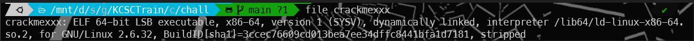
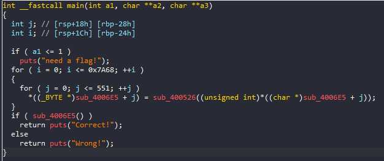
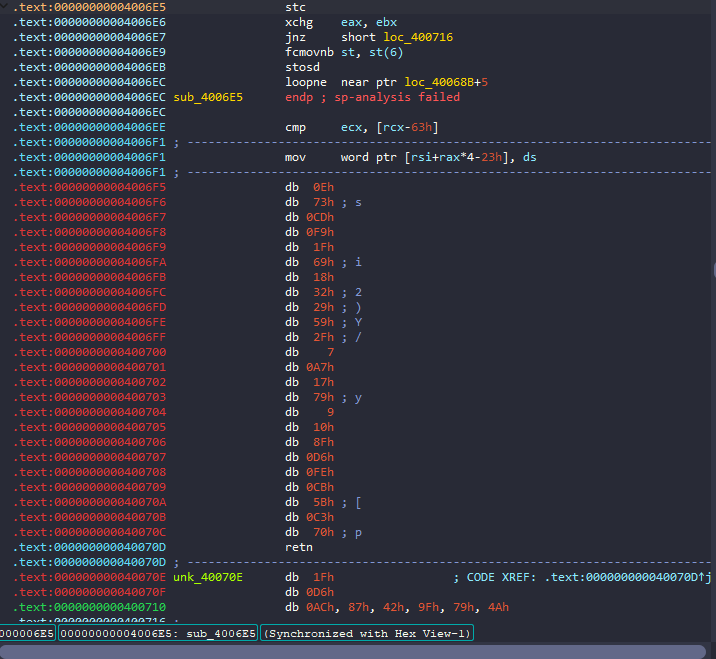
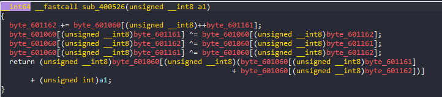
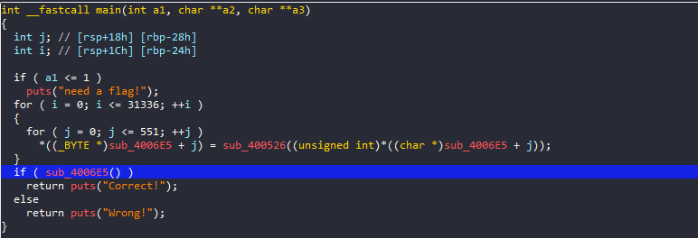
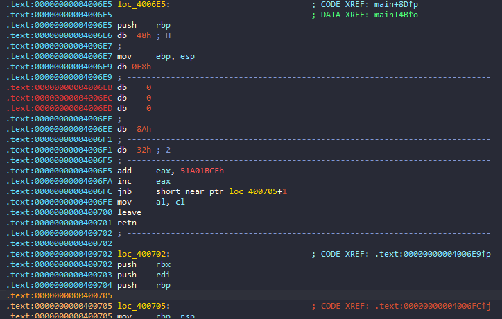

# crackmexxx

## Overview



Bài là một file ELF-64bit

## IDA



Load vào ida, vào hàm main ta thấy chương trình sửa dữ liệu tại hàm `sub_4006E5`:



Rõ ràng hàm này đã bị xáo trộn, hoặc mã hóa, chương trình sẽ giải mã bằng hàm `sub400526`:



Nhưng có lẽ chúng ta không cần quan tâm đến hàm này, vì chắc là chương trình sẽ check `flag` của chúng ta bằng hàm `sub_4006E5` sau khi đã sửa, vì vậy chúng ta chỉ cần đặt breakpoint sau khi hàm đã được sửa và reverse hàm đó là xong:  



Oh no! Hàm được sửa nhưng mình cố gắng `Make Code` bằng ida thì luôn bị lẻ byte nên đọc không hiểu gì cả:



Vì vậy mình sẽ thử debug bằng gdb xem có đọc được không. Đặt breakpoint tại `0x4006db` và chạy chương trình với tham số "3ud4jm0nj4"

```
gef➤  b*0x4006DB
Breakpoint 1 at 0x4006db
gef➤  r 3ud4jm0nj4
Starting program: /mnt/d/security/git/KCSCTrain/crackmexxx/chall/crackmexxx 3ud4jm0nj4
```
Sau đó `si` và chúng ta đã được vào hàm `sub_4006e5` sau khi đã được sửa, dump thử câu lệnh của hàm, vì hàm main chỉ sửa 552 byte nên mình sẽ chỉ lấy đến địa chỉ `0x40090b` :

```asm
gef➤  x/300i $rip
=> 0x4006e5:    push   rbp
   0x4006e6:    mov    rbp,rsp
   0x4006e9:    call   0x400702
   0x4006ee:    mov    cl,al
   0x4006f0:    mov    eax,0xae5fe432
   0x4006f5:    add    eax,0x51a01bce
   0x4006fa:    inc    eax
   0x4006fc:    jae    0x400706
   0x4006fe:    mov    al,cl
   0x400700:    leave
   0x400701:    ret
   0x400702:    push   rbx
   0x400703:    push   rdi
   0x400704:    push   rbp
   0x400705:    mov    rbp,rsp
   0x400708:    mov    rdx,rax
   0x40070b:    dec    eax
   0x40070d:    jmp    0x40070e
   0x40070f:    ror    BYTE PTR [rax-0x75],0xfa
   0x400713:    xor    al,al
   0x400715:    xor    ecx,ecx
   0x400717:    dec    rcx
   0x40071a:    repnz scas al,BYTE PTR es:[rdi]
   0x40071c:    not    ecx
   0x40071e:    dec    ecx
   0x400720:    mov    eax,0x92185987
   0x400725:    xor    eax,0x32963a85
   0x40072a:    jns    0x4006b7
   0x40072c:    mov    eax,0xc3bc42d9
   0x400731:    xor    eax,0x1ed2c907
   0x400736:    jns    0x400742
   0x400738:    push   0x50
   0x40073a:    pop    r9
   0x40073c:    xor    r8d,r8d
   0x40073f:    cmp    r8d,0x539
   0x400746:    jl     0x400763
   0x400748:    jmp    0x400774
   0x40074a:    dec    eax
   0x40074c:    jmp    0x40074d
   0x40074e:    rol    BYTE PTR [rcx-0x7d],0xc0
   0x400752:    add    DWORD PTR [rax+0x669ec28e],edi
   0x400758:    add    eax,0x99613d72
   0x40075d:    inc    eax
   0x40075f:    jae    0x400724
   0x400761:    jmp    0x40073f
   0x400763:    mov    eax,0xe72b5c52
   0x400768:    add    eax,0x18d4a3ae
   0x40076d:    jne    0x400747
   0x40076f:    xor    r11d,r11d
   0x400772:    jmp    0x4007ac
   0x400774:    mov    eax,0xea3e6566
   0x400779:    xor    eax,0x5f69faeb
   0x40077e:    jns    0x4007b6
   0x400780:    lea    rax,[rip+0x164]        # 0x4008eb
   0x400787:    lea    r8,[rax]
   0x40078a:    mov    eax,0xb5de3358
   0x40078f:    xor    eax,0x459f236e
   0x400794:    jns    0x400797
   0x400796:    dec    eax
   0x400798:    jmp    0x400799
   0x40079a:    shr    BYTE PTR [rdx+0x1],0x41
   0x40079e:    pop    rdx
   0x40079f:    dec    eax
   0x4007a1:    jmp    0x4007a2
   0x4007a3:    rol    BYTE PTR [rbp+0x33],0xc9
   0x4007a7:    jmp    0x400834
   0x4007ac:    dec    eax
   0x4007ae:    jmp    0x4007af
   0x4007b0:    rol    BYTE PTR [rbx+rdi*1-0x27],0x7c
   0x4007b5:    add    ch,bl
   0x4007b7:    xchg   edx,eax
   0x4007b8:    mov    eax,0x2b71234a
   0x4007bd:    add    eax,0xd48edcb6
   0x4007c2:    inc    eax
   0x4007c4:    jae    0x400774
   0x4007c6:    movsxd r10,r11d
   0x4007c9:    mov    eax,0xef8ac85b
   0x4007ce:    xor    eax,0xe71ae312
   0x4007d3:    js     0x4007ff
   0x4007d5:    mov    rbx,rdx
   0x4007d8:    add    rbx,r10
   0x4007db:    mov    eax,0x46d3a79d
   0x4007e0:    add    eax,0xb92c5863
   0x4007e5:    jne    0x4007ee
   0x4007e7:    movsxd r10,r11d
   0x4007ea:    mov    eax,0xf45102a7
   0x4007ef:    xor    eax,0xae9accbc
   0x4007f4:    js     0x40085f
   0x4007f6:    mov    rax,rdx
   0x4007f9:    add    rax,r10
   0x4007fc:    mov    al,BYTE PTR [rax]
   0x4007fe:    xor    al,r9b
   0x400801:    mov    BYTE PTR [rbx],al
   0x400803:    movsxd r10,r11d
   0x400806:    mov    rax,rdx
   0x400809:    add    rax,r10
   0x40080c:    mov    al,BYTE PTR [rax]
   0x40080e:    xor    r9b,al
   0x400811:    mov    eax,0x91ecf78
   0x400816:    add    eax,0xf6e13088
   0x40081b:    inc    eax
   0x40081d:    jae    0x4007be
   0x40081f:    add    r11d,0x1
   0x400823:    mov    eax,0x15690edd
   0x400828:    xor    eax,0xd68c1903
   0x40082d:    jns    0x400888
   0x40082f:    jmp    0x4007ac
   0x400834:    mov    eax,0x4759bfd0
   0x400839:    add    eax,0xb8a64030
   0x40083e:    inc    eax
   0x400840:    jae    0x400847
   0x400842:    cmp    r9d,ecx
   0x400845:    jl     0x400849
   0x400847:    jmp    0x400850
   0x400849:    test   r10b,r10b
   0x40084c:    jne    0x400857
   0x40084e:    jmp    0x40089f
   0x400850:    mov    al,r10b
   0x400853:    leave
   0x400854:    pop    rdi
   0x400855:    pop    rbx
   0x400856:    ret
   0x400857:    movsxd r11,r9d
   0x40085a:    mov    eax,0x5f9c75ce
   0x40085f:    xor    eax,0x5d98bd96
   0x400864:    js     0x4008a0
   0x400866:    mov    r10,rdx
   0x400869:    add    r10,r11
   0x40086c:    dec    eax
   0x40086e:    jmp    0x40086f
   0x400870:    rol    BYTE PTR [rbp-0x76],0x1a
   0x400874:    mov    eax,0xf8eca7d8
   0x400879:    add    eax,0x7135828
   0x40087e:    jne    0x40081c
   0x400880:    movsxd rax,r9d
   0x400883:    mov    r10,r8
   0x400886:    add    r10,rax
   0x400889:    mov    eax,0x3b4ad836
   0x40088e:    xor    eax,0xf1d7dbea
   0x400893:    jns    0x400818
   0x400895:    mov    al,BYTE PTR [r10]
   0x400898:    cmp    r11b,al
   0x40089b:    je     0x4008c3
   0x40089d:    jmp    0x4008da
   0x40089f:    xor    r10b,r10b
   0x4008a2:    mov    eax,0x2e4ef210
   0x4008a7:    add    eax,0xd1b10df0
   0x4008ac:    jne    0x40087e
   0x4008ae:    mov    eax,0x1bff10d0
   0x4008b3:    xor    eax,0x9dd00315
   0x4008b8:    jns    0x40091d
   0x4008ba:    add    r9d,0x1
   0x4008be:    jmp    0x400834
   0x4008c3:    mov    eax,0x451c2342
   0x4008c8:    add    eax,0xbae3dcbe
   0x4008cd:    jne    0x400901
   0x4008cf:    push   0x1
   0x4008d1:    pop    r10
   0x4008d3:    dec    eax
   0x4008d5:    jmp    0x4008d6
   0x4008d7:    shr    bl,0x3
   0x4008da:    xor    r10b,r10b
   0x4008dd:    mov    eax,0x5e82d693
   0x4008e2:    add    eax,0xa17d296d
   0x4008e7:    jne    0x40090a
   0x4008e9:    jmp    0x4008a2
   0x4008eb:    rex.W pop rdi
   0x4008ed:    ss xor eax,0x2c142535
   0x4008f3:    sbb    eax,0xc2d0301
   0x4008f8:    outs   dx,DWORD PTR ds:[rsi]
   0x4008f9:    xor    eax,0xa347e61
   0x4008fe:    rex.R and al,0x2c
   0x400901:    rex.WX
   0x400902:    rex.RX sbb DWORD PTR [rcx+0x5b],r11d
   0x400906:    (bad)
   0x400907:    js     0x40097d
   0x400909:    sub    DWORD PTR [rbx],edx
   0x40090b:    sub    al,0x0
```
Nhìn rất rối nhưng chúng ta có thể để ý có những đoạn `mov` rồi `add` giá trị rất to vào eax rồi nhảy:
```asm
0x4006f0:    mov    eax,0xae5fe432
0x4006f5:    add    eax,0x51a01bce
0x4006fa:    inc    eax
0x4006fc:    jae    0x400706
```
Nếu nhìn kĩ thì những dòng này vô nghĩa, không ảnh hưởng gì đến `eax` hay flow của chương trình, vì trước đó `eax` được lưu tạm tại nơi nào đó rồi lại trả lại giá trị, và mình đã debug thử thì tất cả các lệnh jump ở những dòng như này sẽ không bao giờ được kích hoạt.

Vấn đề nữa của đoạn này là có những câu lệnh jmp vào những byte lẻ nhưng lại không có dòng đó mà lại thay vào một dòng rất khó hiểu thì ta sẽ dump lệnh ở địa chỉ đó ra. Ví dụ dòng này:

```asm
 0x4007ae:    jmp    0x4007af
 0x4007b0:    rol    BYTE PTR [rbx+rdi*1-0x27],0x7c
```
Thì ta sẽ dump tại địa chỉ đó 
```asm
gef➤  x/5i 0x4007af
   0x4007af:    inc    eax
   0x4007b1:    cmp    r11d,ecx
   0x4007b4:    jl     0x4007b8
   0x4007b6:    jmp    0x40074a
   0x4007b8:    mov    eax,0x2b71234a
```
Và với flag chúng ta nhập vào được lưu trong rax 

```asm
gef➤  x/s $rax
0x7fffffffdf4e: "3ud4jm0nj4"
```
Với những điều trên thì mình đã sửa lại hàm và comment cho dễ đọc:
```asm
   0x4006e5:    push   rbp
   0x4006e6:    mov    rbp,rsp
   0x4006e9:    call   0x400702
   0x4006ee:    mov    cl,al			;nếu check thành công sẽ return eax =1

   0x4006fe:    mov    al,cl
   0x400700:    leave
   0x400701:    ret

   0x400702:    push   rbx
   0x400703:    push   rdi
   0x400704:    push   rbp
   0x400705:    mov    rbp,rsp
   0x400708:    mov    rdx,rax			;sao chép input chúng ta nhập vào rdx
   0x400710:    mov    rdi,rdx
   0x400713:    xor    al,al
   0x400715:    xor    ecx,ecx
   0x400717:    dec    rcx
   0x40071a:    repnz scas al,BYTE PTR es:[rdi]	;https://stackoverflow.com/questions/26783797/repnz-scas-assembly-instruction-specifics
   0x40071c:    not    ecx			  ;hàm này tính độ dài của chuỗi ta nhập vào và lưu vào ecx
   0x40071e:    dec    ecx                  
   0x400738:    push   0x50
   0x40073a:    pop    r9                   ;r9=0x50
   0x40073c:    xor    r8d,r8d
   0x40073f:    cmp    r8d,0x539            ;for(r8d = 0; r8d < 1337; ++r8d)
   0x400746:    jl     0x400763             ;bé hơn thì nhảy đến 763 tiếp tục lặp
   0x400748:    jmp    0x400774             ;nếu lớn hơn thì nhảy đến câu lệnh để kết thúc vòng lặp
   0x40074a:
   0x40074f:    add    r8d,0x1               ;r8+=1
  
   0x400761:    jmp    0x40073f            
   0x400763:
   0x40076f:    xor    r11d,r11d           ;reset biến đếm thứ 2
   0x400772:    jmp    0x4007ac            ;bắt đầu vòng lặp 2
   0x400774:
   0x400780:    lea    rax,[rip+0x164]        # 0x4008eb ; GDB đã cho ta biết cipher đc lưu vào r8
   0x400787:    lea    r8,[rax]

   0x40079b:    push   0x1			
   0x40079d:    pop    r10			;r10=0x1


   0x4007a4:    xor    r9d,r9d      ;r9d = 0

   0x4007a7:    jmp    0x400834
   0x4007ac:
   0x4007b1:    cmp    r11d,ecx            ;so sánh r11d với độ dài chuỗi
   0x4007b4:    jl     0x4007b8            ;nếu nhỏ hơn thì nhảy đến 7b8
   0x4007b6:    jmp    0x40074a            ;nếu đã đạt đến độ dài của chuỗi thì nhảy đến 74a để kết thúc vòng lặp
   0x4007b8:
   0x4007c6:    movsxd r10,r11d         ;movsxd để mov 32bit to 64 bit, lưu vị trí hiện tại vào r10

   0x4007d5:    mov    rbx,rdx          ;rdx là chuỗi của chúng ta nhập vào => mov rbx, offset flag
   0x4007d8:    add    rbx,r10          ;lấy chỉ số i của chuỗi => flag[i]

   0x4007e7:    movsxd r10,r11d         ; mov again

   0x4007f6:    mov    rax,rdx          ;rax = offset flag
   0x4007f9:    add    rax,r10          ;flag[i]
   0x4007fc:    mov    al,BYTE PTR [rax] ;al= flag[i]
   0x4007fe:    xor    al,r9b               ;xor flag[i] vs r9b( r9b = 0x50)
   0x400801:    mov    BYTE PTR [rbx],al    ;flag[i] = flag[i] ^ 0x50
   0x400803:    movsxd r10,r11d             ; r10=i
   0x400806:    mov    rax,rdx
   0x400809:    add    rax,r10
   0x40080c:    mov    al,BYTE PTR [rax]    ;al = flag[i] 
   0x40080e:    xor    r9b,al               ;r9b= 0x50 xor flag[i] => lưu giá trị của flag[i] vừa xor vào lại r9b để xor với kí tự tiếp theo
   0x40081f:    add    r11d,0x1             ;i=i+1
   0x40082f:    jmp    0x4007ac             ;loop to 7ac


   0x400834:
   0x400842:    cmp    r9d,ecx          ;so sánh r9d vs len(flag)
   0x400845:    jl     0x400849         ;for r9d in range(len(flag)):
   0x400847:    jmp    0x400850
   0x400849:    test   r10b,r10b        ;test r10 có bằng 0 hay không
   0x40084c:    jne    0x400857         ;nếu không thì nhảy đến 857 tiếp tục vòng lặp
   0x40084e:    jmp    0x40089f
   0x400850:    mov    al,r10b
   0x400853:    leave
   0x400854:    pop    rdi
   0x400855:    pop    rbx
   0x400856:    ret
   0x400857:    movsxd r11,r9d          ;mov biến đếm vào r11
   0x400866:    mov    r10,rdx          ;mov địa chỉ flag vào r10
   0x400869:    add    r10,r11          ;lấy địa chỉ của flag[i]
   0x400871:    mov    r11b,BYTE PTR [r10] ;r11b = flag[i]
   0x400880:    movsxd rax,r9d          ;mov biến đếm vào rax 
   0x400883:    mov    r10,r8           ;r8 là cipher, mov r8 vào r10
   0x400886:    add    r10,rax          ;lấy địa chỉ của cipher[i]
   0x400895:    mov    al,BYTE PTR [r10] ;al = cipher [i]
   0x400898:    cmp    r11b,al          ;so sánh flag[i] == cipher [i]
   0x40089b:    je     0x4008c3         ;nếu bằng thì tiếp tục vòng lặp 
   0x40089d:    jmp    0x4008da
   0x40089f:    xor    r10b,r10b
   0x4008a2:
   0x4008ba:    add    r9d,0x1
   0x4008be:    jmp    0x400834
   0x4008c3:
   0x4008cf:    push   0x1
   0x4008d1:    pop    r10  ;lại cho r10=1 để tiếp tục lặp
   0x4008d8:    jmp    0x4008dd 
   0x4008da:    xor    r10b,r10b    ; nếu flag[i] khác cipher[i] thì sẽ nhảy vào đây, đặt r10=0, check sẽ kết thúc vòng lặp
   0x4008dd:
   0x4008e9:    jmp    0x4008a2

   0x4008eb:    rex.W pop rdi       ;đây là phần cipher chúng ta không cần quan tâm đến phần này
   0x4008ed:    ss xor eax,0x2c142535
   0x4008f3:    sbb    eax,0xc2d0301
   0x4008f8:    outs   dx,DWORD PTR ds:[rsi]
   0x4008f9:    xor    eax,0xa347e61
   0x4008fe:    rex.R and al,0x2c
   0x400901:    rex.WX
   0x400902:    rex.RX sbb DWORD PTR [rcx+0x5b],r11d
   0x400906:    (bad)
   0x400907:    js     0x40097d
   0x400909:    sub    DWORD PTR [rbx],edx
   0x40090b:    sub    al,0x0
```
Dòng `0x400780` gdb đã cho chúng ta biết `Cipher` để so sánh với flag được lưu tại `0x4008eb`, Và vì hàm chỉ sửa đến byte ở địa chỉ `0x40090c` nên mạnh dạn đoán flag sẽ gồm 33 kí tự ( `0x4008eb` đến `0x40090c` có 33 kí tự).

Nếu bạn muốn biết mình đã xóa những gì thì hãy xem file [check.asm](./check.asm) mình đã để `comment` những dòng k cần thiết, hoặc vẫn thấy khó đọc thì đây là code python của hàm này mình đã viết lại:
```python
r9b=0x50
cipher = [0x48, 0x5f, 0x36, 0x35, 0x35, 0x25, 0x14, 0x2c, 0x1d, 0x01, 0x03, 0x2d,
        0x0c, 0x6f, 0x35, 0x61, 0x7e, 0x34, 0x0a, 0x44, 0x24, 0x2c, 0x4a, 0x46,
        0x19, 0x59, 0x5b, 0x0e, 0x78, 0x74, 0x29, 0x13, 0x2c]
for r8d in range(0x539):
    for r11d in range(len(flag)):
        flag[r11d]=flag[r11d]^r9b
        r9b = r9b ^ flag[r11d]
for i in len(cipher):
    if(flag[i]!=cipher[i]):
        break
```
Bài này mình sẽ dùng `z3` để giải

## script
```python
from z3 import *

data = [
        0x48, 0x5f, 0x36, 0x35, 0x35, 0x25, 0x14, 0x2c, 0x1d, 0x01, 0x03, 0x2d,
        0x0c, 0x6f, 0x35, 0x61, 0x7e, 0x34, 0x0a, 0x44, 0x24, 0x2c, 0x4a, 0x46,
        0x19, 0x59, 0x5b, 0x0e, 0x78, 0x74, 0x29, 0x13, 0x2c
        ]

flag = [BitVec(f'{i:2}', 8) for i in range(len(data))] #khoi tao index cho flag 
s = Solver()
# giới hạn flag chỉ nằm trong mã ascii in ra được
for f in flag:
    s.add(f > 0x20, f <= 0x7f)

xored = 0x50
for r8d in range(0x539):
    for r11d in range(len(flag)):
        flag[r11d]=flag[r11d]^xored
        xored = xored ^ flag[r11d]
#add thêm điều kiện để lấy flag đúng 
for f, d in zip(flag, data):
    s.add(f == d)
#nếu thành công thì in ra sat và ngược lại là unsat
print(s.check())
#s.model là list hợp lệ chương trình tính được
m = s.model()
# ví list bị đảo lộn thứ tự nên ta sẽ sắp xếp lại theo index cho đúng thứ tự và lưu vào model
model = sorted([(d, m[d]) for d in m], key = lambda x: str(x[0]))
for m in model:
     print(chr(m[1].as_long()), end='')
```
## flag 
`pctf{ok_nothing_too_fancy_there!}`


 

